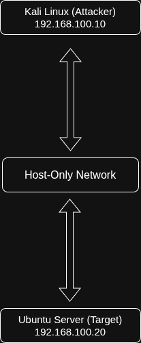
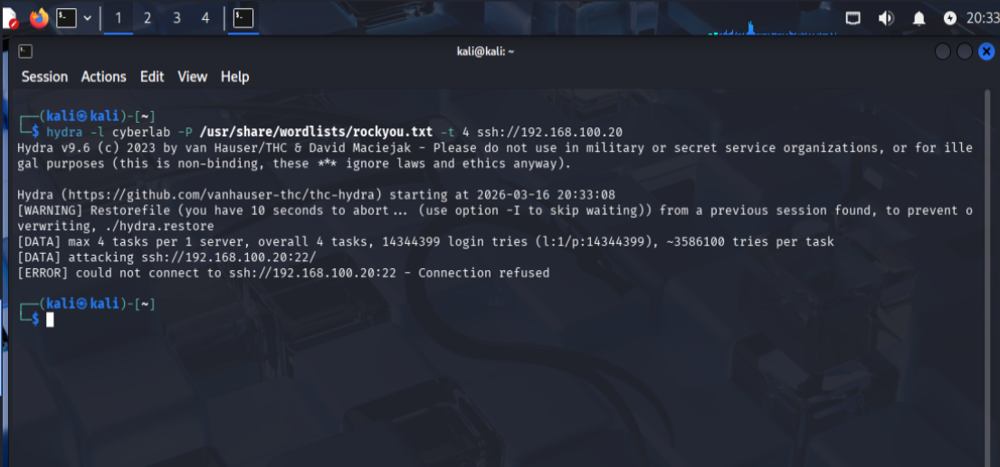
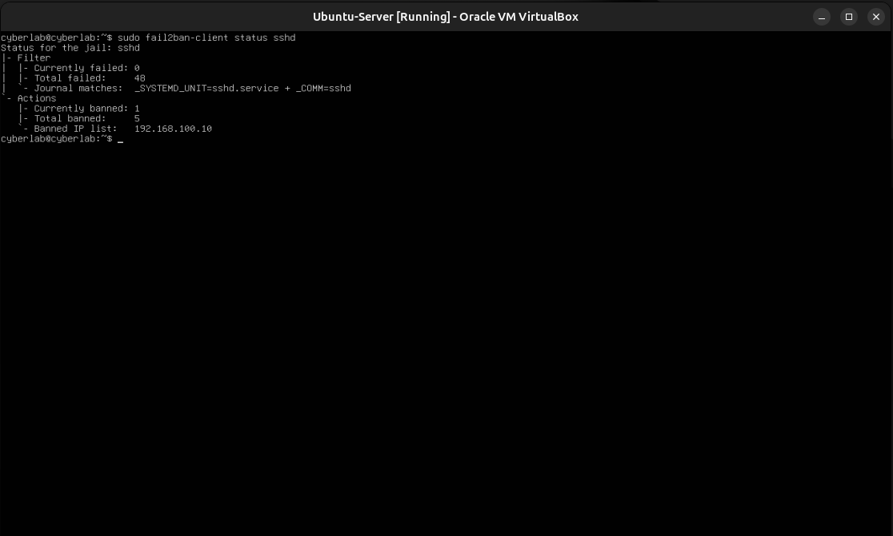

Laboratório de Segurança Cibernética para Servidores Linux

Laboratório de segurança cibernética focado no fortalecimento de servidores Linux.

## Tecnologias

- Ubuntu Server
- Kali Linux
- Nmap
- Hydra
- Fail2ban
- UFW

## Lab Topology

## Attack Simulation

Hydra brute force attempt against SSH.

## Fail2ban Blocking Attacker

Fail2ban automatically blocks attacker IP.

## Objetivos do Laboratório

Implementar controles de segurança para proteger o serviço SSH e prevenir ataques de força bruta.

## Simulação de Ataque

Tentativa de força bruta com o Hydra contra o SSH.

## Mecanismo de Defesa

O Fail2ban bloqueia automaticamente o IP do atacante após múltiplas tentativas de login malsucedidas.
